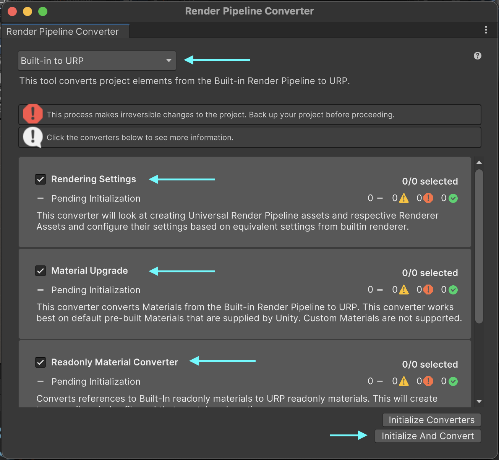
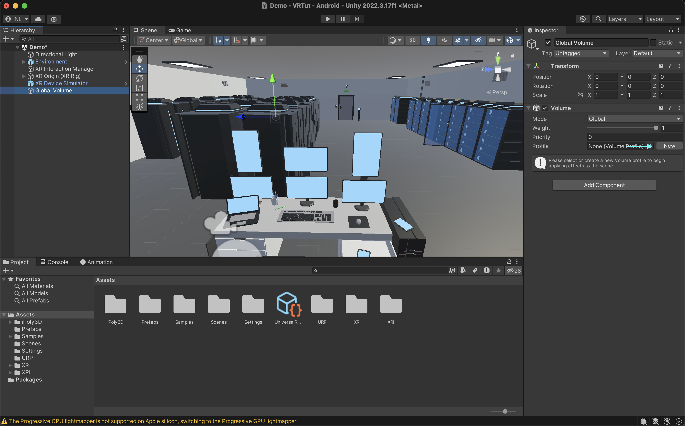
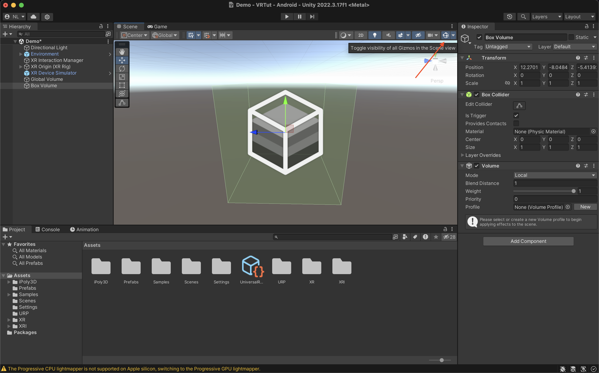

# How to Add Post-Processing to an Existing Unity 3D Project

## Download and open the Week 5 Unity Project

1. Duplicate existing Week 5 VRTut project or Download the zip file [HERE](https://drive.google.com/file/d/1iMGUauE0O7175kPf6t7hNDXoElbM_YP8/view?usp=sharing)
2. Open UnityHub → Open → Add project from disk → (select) duplicated VRTut (folder)
3. Click and open VRTur Unity project
4. You should see the server room from Week 5

## Add the Universal RP Package from Unity Registry

1. Open the Package Manager (Window > Package Manager)
2. Search for `Universal RP` in the Unity Registry
3. Install the `Universal RP` package into your project

## Creating a URP Asset

1. Go to Assets
2. Create > Rendering > URP Asset (with Universal Renderer)

3. You should see 2 new assets being created
    - New Universal Render Pipeline Asset
    - New Universal Render Pipeline Asset_Renderer

## Configure project to use URP

1. Open Project Graphics Settings (Edit > Project Settings > Graphics)

2. Set `Scriptble Render Pipeline Settings (Render Pipeline Asset)` to the newly created `New Universal Render Pipeline Asset`

## Oh no! Why are my assets pink?

Answer: Run Render Pipeline Converter

1. Open the Render Pipeline Converter (Window > Rendering > Render Pipeline Converter)

2. Make sure Built-in to URP is selected and all items in the list are selected

3. Run Initialize And Convert

## Enable post-processing for all cameras
For any cameras you want post processing applied to during gameplay, you have to enable Post Processing for each camera.

1. In your hierarchy, find your camera (XR Origin (XR Rig) > Camera Offset > Main Camera)

2. Look at the Inspector, under Rendering, enable `Post Processing`

## Volumes I (Global Volume)

1. Create a new `Global Volume` object in the Hierarchy (Hierarchy > Volume > Global Volume)

2. View the newly created `Global Volume` in the Inspector and press `New` under Profile to createa a new volume profile

3. A new section will appear below Profile, click `Add Override` under the new Profile.

4. Add the `Bloom` effect and set the following values, WARNING: the screen will flash during this step during the re-render.

5. Observe that some game objects have a "glow" emitting from them

## Volumes II (Local Volume)

1. Create a new `Box Volume` object in the Hierarchy (Hierarchy > Volume > Box Volume)

2. Select the newly created `Box Volume` and toggle gizmo visibility to see the area the Box Volume takes effect (you should now see a green highlighted box)

3. Move the `Box Volume` into the Server Room

4. Select the `Box Volume`, add a new Volume Profile and change its Priority to 1

5. Add any effect, in this case lets try to add a desaturation effect (Add Override > Color Adjustments > Set Saturation to -100)

6. Observe that moving into the box volume area removes all colour:

## References

1. [YouTube - HOW TO DO POST PROCESSING IN UNITY 🎮 | URP Unity Post Effects Tutorial | Learn Unity](https://youtu.be/yugZTujILB0?si=CIsiNG2pa1Al6TDV)
2. [Unity Manual - Install URP into an existing Project](https://docs.unity3d.com/Packages/com.unity.render-pipelines.universal@14.0/manual/InstallURPIntoAProject.html)
3. [Unity Manual - Render Pipeline Converter](https://docs.unity3d.com/Packages/com.unity.render-pipelines.universal@14.0/manual/features/rp-converter.html)
